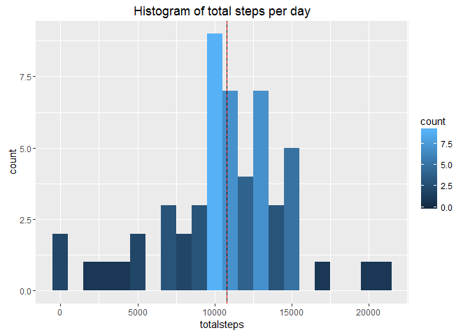
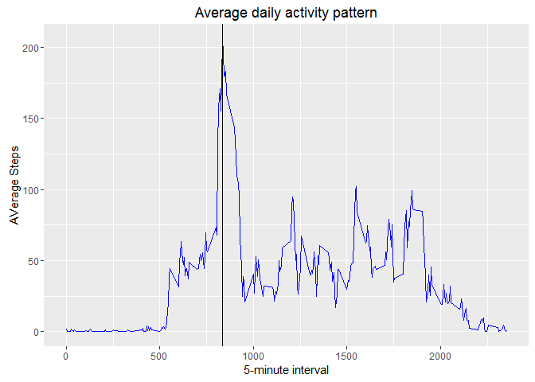
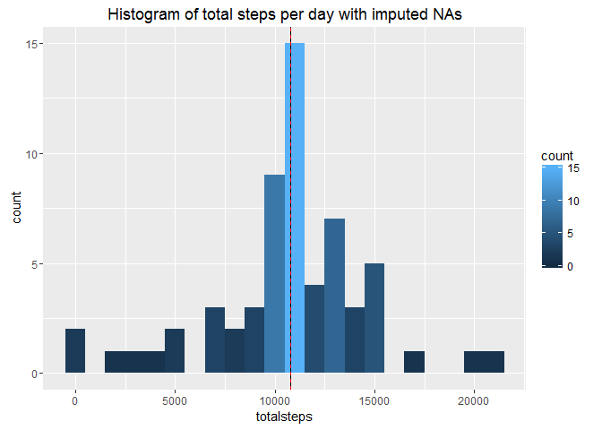
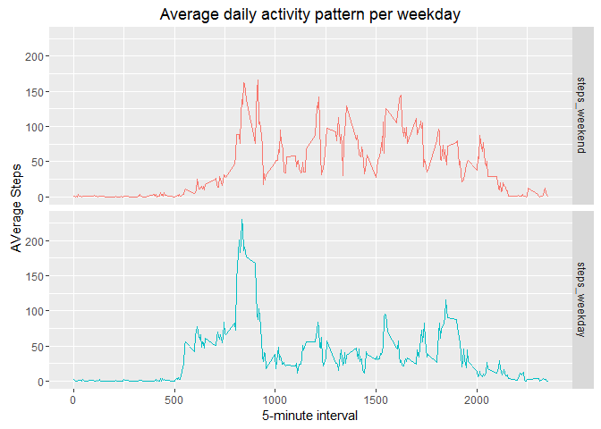

# Reproducible Research: Peer Assessment 1


## Loading and preprocessing the data

```r
library(ggplot2)
library(reshape2)
```

```r
rawdata<-"D:/GitHubRepositories/DataScience/RepData_PeerAssessment1/activity.zip"

datset<-read.csv(unz(rawdata,"activity.csv"),header=TRUE,stringsAsFactors=FALSE)
```

Check the format of "date"

```r
str(datset)
```

```
## 'data.frame':	17568 obs. of  3 variables:
##  $ steps   : int  NA NA NA NA NA NA NA NA NA NA ...
##  $ date    : chr  "2012-10-01" "2012-10-01" "2012-10-01" "2012-10-01" ...
##  $ interval: int  0 5 10 15 20 25 30 35 40 45 ...
```

Transform the character-object "date" into a date-format object

```r
datset$date<-as.Date(datset$date)
str(datset)
```

```
## 'data.frame':	17568 obs. of  3 variables:
##  $ steps   : int  NA NA NA NA NA NA NA NA NA NA ...
##  $ date    : Date, format: "2012-10-01" "2012-10-01" ...
##  $ interval: int  0 5 10 15 20 25 30 35 40 45 ...
```

## What is the mean total number of steps taken per day?


```r
datset2<-na.omit(datset) #removing NAs
totalstepday<-as.data.frame(tapply(datset2$steps,datset2$date,sum,na.rm=TRUE,simplify=TRUE));colnames(totalstepday)<-c("totalsteps")
head(totalstepday)
```

```
##            totalsteps
## 2012-10-02        126
## 2012-10-03      11352
## 2012-10-04      12116
## 2012-10-05      13294
## 2012-10-06      15420
## 2012-10-07      11015
```
Calculate the mean and median:

```r
avg<-round(mean(totalstepday$totalsteps),2)
median<-median(totalstepday$totalsteps)
```
The mean and median of the total number of steps taken per day is 10766.19 and 10765 respectively. 

Create a histogram showing the results. The black vertical line represents the mean  while the dashed red line represents the median:

```r
ggplot(totalstepday,aes(x=totalsteps))+geom_histogram(binwidth=1000,aes(fill=..count..))+labs(title="Histogram of total steps per day")+geom_vline(xintercept=avg,col="black")+geom_vline(xintercept=median,linetype=2,col="red")
```

\


## What is the average daily activity pattern?

```r
avgstepsinterval<-as.data.frame(tapply(datset2$steps,datset2$interval,mean,na.rm=TRUE,simplify=TRUE));
avgstepsinterval<-data.frame(cbind(as.numeric(rownames(avgstepsinterval)),as.numeric(avgstepsinterval[,1])),stringsAsFactors=FALSE,row.names=NULL);colnames(avgstepsinterval)<-c("interval","averagesteps")

head(avgstepsinterval)
```

```
##   interval averagesteps
## 1        0        1.717
## 2        5        0.340
## 3       10        0.132
## 4       15        0.151
## 5       20        0.075
## 6       25        2.094
```
Calculate the 5-minute interval which contains on average the maximum number of steps:

```r
maxinterv<-avgstepsinterval[which.max(as.numeric(avgstepsinterval$averagesteps)),]
maxinterv
```

```
##     interval averagesteps
## 104      835          206
```
The average maximum number of steps is 206.17, the corresponding interval is 835.

Plot the results. The black vertical line represents the interval with the maximum average number of steps:

```r
ggplot(avgstepsinterval,aes(x=interval,y=averagesteps))+geom_line(color="blue")+labs(title="Average daily activity pattern",y="AVerage Steps",x="5-minute interval")+geom_vline(xintercept=maxinterv$interval)
```

\


## Imputing missing values
Calculate the number of incomplete cases:

```r
incomp<-nrow(datset)-sum(complete.cases(datset))
incomp
```

```
## [1] 2304
```
Next we are asked to design a strategy for imputing missing values. Here missing values will be imputed with the mean for the 5-minute interval.

```r
#Split the data frame in complete and incomplete cases
incompcases<-datset[!complete.cases(datset),]
compcases<-datset[complete.cases(datset),];compcases$steps<-as.numeric(compcases$steps)
#Impute NAs by merging
imputedNA<-merge(incompcases,avgstepsinterval,by="interval",all.x=TRUE)
#Reshape
imputedNA<-subset(x=imputedNA,select=c("averagesteps","date","interval"));colnames(imputedNA)<-c("steps","date","interval")
#Append the imputed NA-cases with the complete cases and sort
datsetNA<-rbind(compcases,imputedNA)
datsetNA<-datsetNA[order(datsetNA$date,datsetNA$interval),]
#Calculate the total number of steps using the new data set
totalstepdayNA<-as.data.frame(tapply(datsetNA$steps,datsetNA$date,sum,na.rm=TRUE,simplify=TRUE));colnames(totalstepdayNA)<-c("totalsteps")
head(totalstepdayNA)
```

```
##            totalsteps
## 2012-10-01      10766
## 2012-10-02        126
## 2012-10-03      11352
## 2012-10-04      12116
## 2012-10-05      13294
## 2012-10-06      15420
```

```r
#Calculate mean and median
avgNA<-round(mean(totalstepdayNA$totalsteps),2)
medianNA<-median(totalstepdayNA$totalsteps)
```
The next step is making a histogram with the new data set including the imputed NAs. The mean (10766.19) is represented in the histogram with a straight black line while the median (10766.19) is represented with a dashed red line:

```r
ggplot(totalstepdayNA,aes(x=totalsteps))+geom_histogram(binwidth=1000,aes(fill=..count..))+labs(title="Histogram of total steps per day with imputed NAs")+geom_vline(xintercept=avgNA,col="black")+geom_vline(xintercept=medianNA,linetype=2,col="red")
```

\
We can observe that only the median changes when using the data set with the imputed NAs, while the mean remains unchanged. Imputing the NAs has caused the median to be exactly the same as the mean.


## Are there differences in activity patterns between weekdays and weekends?

```r
#Create a factor variable with two levels: weekday and weekend
wday<-weekdays(datsetNA$date)
wday[wday=="Samstag"|wday=="Sonntag"]<-1
wday[wday != 1]<-2
datsetwday<-datsetNA
datsetwday$wdayf<-factor(wday,levels=c("1","2"),labels=c("weekend","weekday"))

#Calculate the average number of steps for the 5-minute intervals for weekdays and weekends
avgstepinterwday<-as.data.frame(tapply(datsetwday$steps,list(datsetwday$interval,datsetwday$wdayf),mean,na.rm=TRUE))
avgstepinterwday<-data.frame(cbind(as.numeric(rownames(avgstepinterwday)),as.numeric(avgstepinterwday[,1]),as.numeric(avgstepinterwday[,2])),stringsAsFactors=FALSE,row.names=NULL);colnames(avgstepinterwday)<-c("interval","steps_weekend","steps_weekday")
#Reshape data into a long format
avgstepinterwdaylong<-melt(avgstepinterwday,id.vars=c("interval"),measure.vars=c("steps_weekend","steps_weekday"))
```

Create a plot with results:

```r
ggplot(avgstepinterwdaylong,aes(x=interval,y=value,colour=variable))+geom_line()+labs(title="Average daily activity pattern per weekday",y="AVerage Steps",x="5-minute interval")+facet_grid(variable~.)+theme(legend.position="none")
```

\
